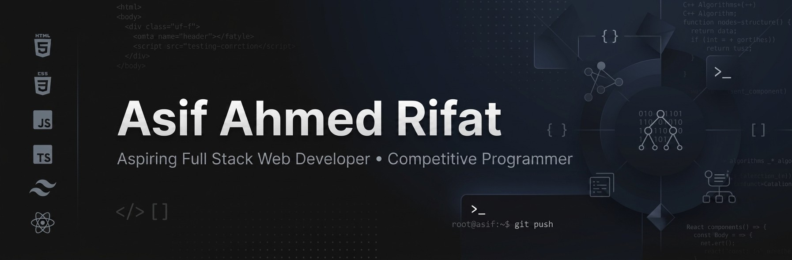

 

# Hi 👋, I'm Asif Ahmed Rifat

### Aspiring Full Stack Web Developer & Competitive Programmer | CSE Student

 

## 👨‍💻 About Me

I'm a Computer Science & Engineering student from Bangladesh who got hooked on programming the moment I realized I could build things that actually work — not just read about how they work. Right now I'm laying the foundation for full-stack development, starting with the frontend and steadily working my way toward the backend.

I learn best by building rather than passively following tutorials, so most of my growth comes from small real-world projects, breaking things, and figuring out how to fix them. I care about writing code that's clean and easy to understand, and outside of web development, I enjoy solving programming problems to sharpen my problem-solving skills. My long-term goal is simple: become a solid, professional full-stack developer.

 

## 🚀 What I'm Currently Working On

- 🌱 Exploring React and modern full-stack development
- ⚛️ Deepening my understanding of React and TypeScript
- 🎨 Improving my frontend skills with Tailwind CSS
- 🛠️ Building practical web projects to strengthen my development skills
- 💻 Practicing programming and problem-solving
- 📚 Learning backend development, APIs, and databases
- 🔍 Exploring how modern production-ready web applications are structured

 

## 🛠️ Skills & Technologies

**Languages**

**Frontend** &nbsp;(actively learning)

**Tools**

 

## 🌐 Connect With Me

&nbsp;&nbsp;
&nbsp;&nbsp;

 

## 📊 GitHub Statistics

 

 

## 🐍 Contribution Graph

 

<!--## 🚀 Featured Projects -->

<!-- 👉 Replace with your real repositories. Remove the demo link row for projects without a live demo. -->

<!--| Project | Description | Tech Stack | Links |
|---|---|---|---|
| **[Project Name](PROJECT_URL)** | Short description of what this project does and the problem it solves. | HTML, CSS, JavaScript | [Repo](PROJECT_URL) · [Live Demo](LIVE_DEMO_URL) |
| **[Project Name](PROJECT_URL)** | Short description of what this project does and the problem it solves. | React, Tailwind CSS | [Repo](PROJECT_URL) · [Live Demo](LIVE_DEMO_URL) |

  -->

### 💭 
*"Consistency beats intensity — a little better every day."*

 

---

Thanks for visiting my profile! Let's build something meaningful together. 🚀

